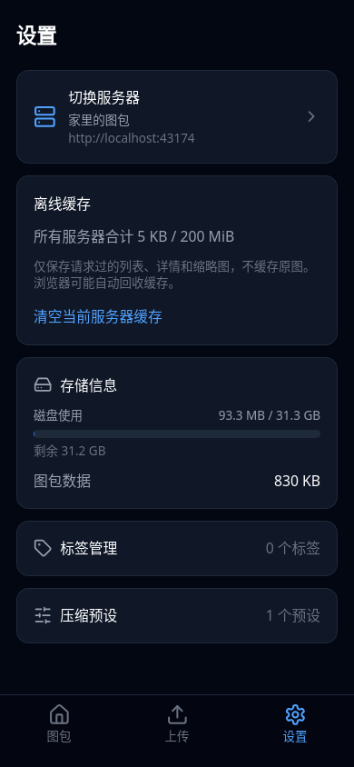
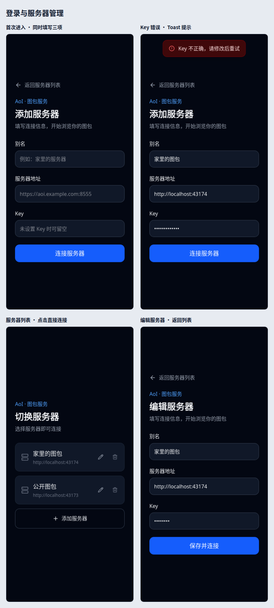
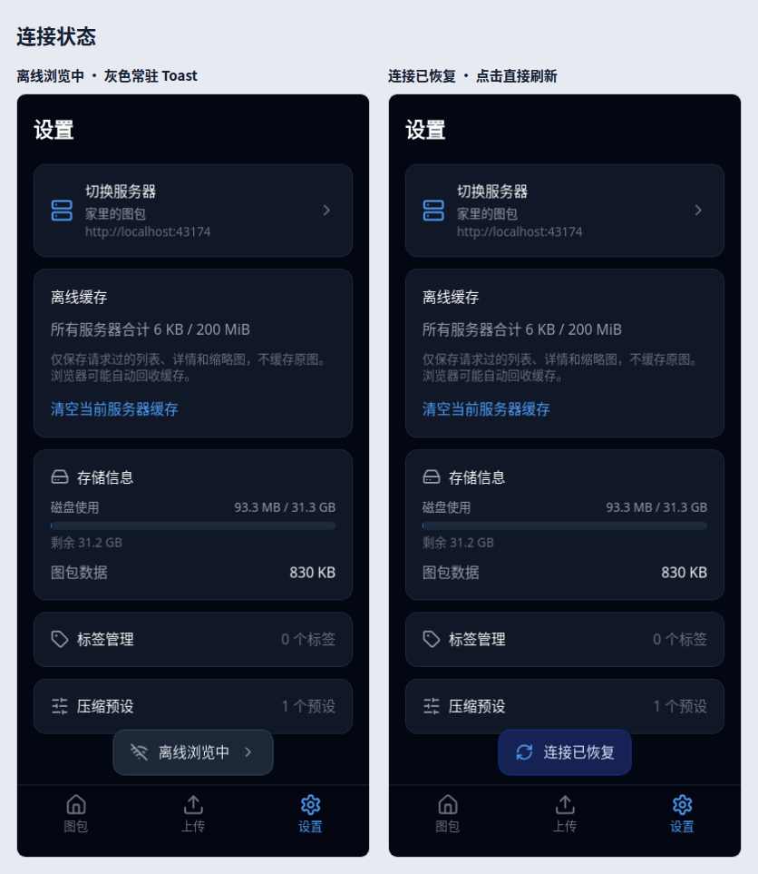

# 登录与服务器切换

真实页面截图，使用 WebKit、390 × 844 手机视口。尚未在 iOS 真机验证。

第三个「设置」tab 的第一张卡片是「切换服务器」入口：

初次无记录时直接显示别名、服务器地址和 Key 三个输入框；错误使用 toast。服务器列表与新增/编辑表单使用独立路由，支持返回列表和浏览器后退。点击服务器记录直接连接，编辑/删除使用图标。

离线提示为灰色常驻 toast，点击显示说明、刷新和切换服务器操作。恢复提示点击直接刷新，没有第二层弹窗。

## 单张截图

1. [首次进入，无服务器记录](01-new-server.png)
2. [Key 错误 toast](02-login-error-toast.png)
3. [第三个设置 tab 中的入口](03-settings-entry.png)
4. [服务器列表与全宽添加按钮](04-server-list.png)
5. [新增服务器表单](05-add-server.png)
6. [编辑服务器表单](06-edit-server.png)
7. [离线浏览常驻 toast](07-offline-toast.png)
8. [离线说明弹窗](08-offline-dialog.png)
9. [连接已恢复 toast](09-recovered-toast.png)
10. [服务器无法连接 toast](10-connection-error-toast.png)

WebKit 验证：三项同页输入、错误不保存未验证记录、列表点击即连接、编辑回填、图标删除、表单返回/浏览器后退、自动登录、离线重新打开、toast 常驻且不影响页面高度、恢复后点击直接刷新。
