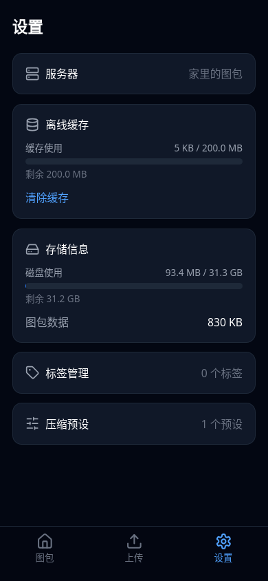
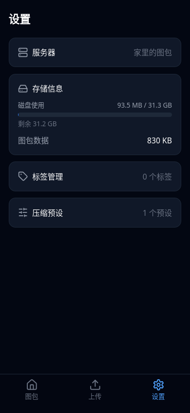
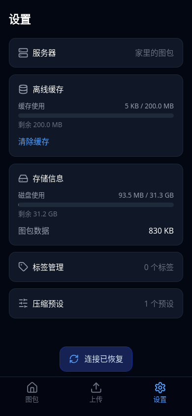

# 设置与恢复连接

WebKit、390 × 844 手机视口实拍。PWA 截图通过模拟 iOS `navigator.standalone` 启用安装模式；未做 iOS 真机验证。

| PWA | 普通浏览器 |
| --- | --- |
|  |  |

服务器项使用 18px 图标，右侧灰字显示别名。仅 PWA 显示离线缓存，进度条表示所有服务器的合计缓存；「清除缓存」清空业务缓存。普通浏览器不读写离线业务缓存。

恢复连接后，点击 toast 或第一个图包 tab 会刷新到图包页，保留分页、搜索及其他查询参数，并隐藏 toast。普通浏览器刷新同样隐藏提示。

验证覆盖：WebKit 与 Chromium 中的设置样式、浏览器与 PWA 共用 Worker 时的缓存隔离、清除缓存、恢复提示与首页点击、分页和筛选保留；WebKit 后端不可达时重开缓存；Chromium 完全断网时重开 PWA。
