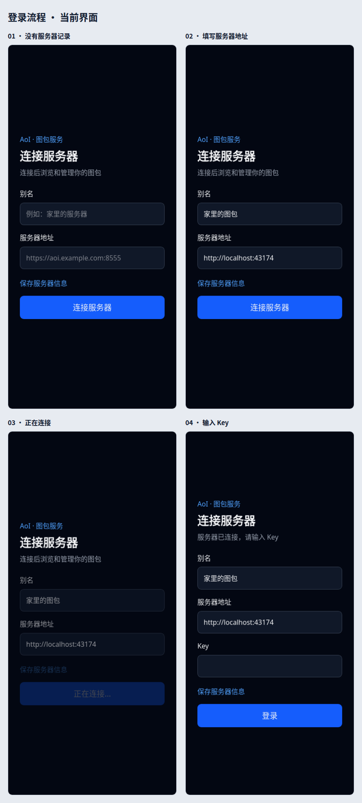
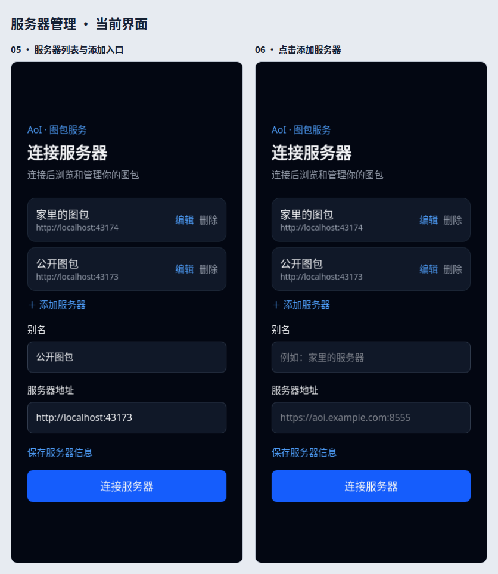
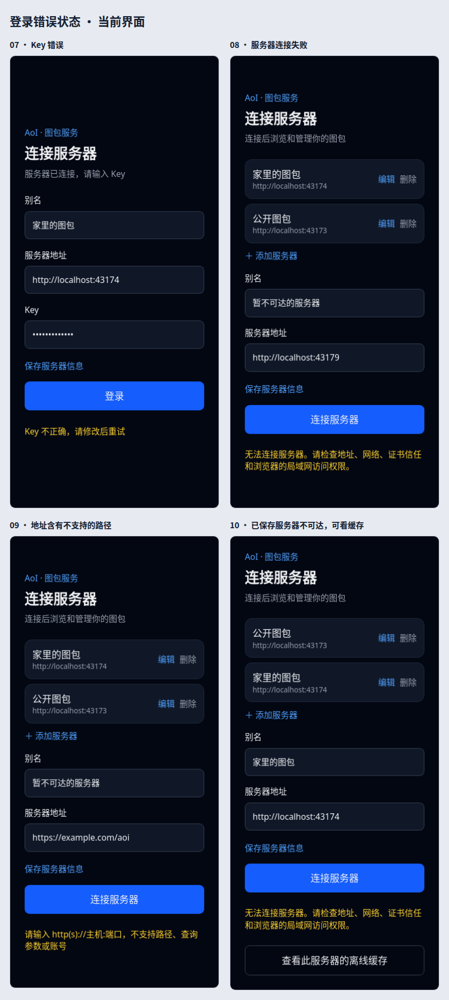
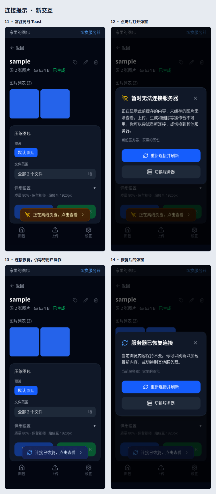

# 连接流程截图

使用 WebKit、390 × 844 手机视口截取真实页面。登录交互保持当前实现；离线提示已改为常驻 toast，点击打开弹窗。

## 登录流程

## 服务器管理

## 错误状态

## 连接提示

## 单张原图

1. [无服务器记录](01-empty.png)
2. [填写服务器地址](02-server-address.png)
3. [连接中](03-connecting.png)
4. [输入 Key](04-key.png)
5. [Key 错误](05-key-error.png)
6. [服务器列表](06-server-list.png)
7. [添加服务器](07-add-server.png)
8. [连接失败](08-connection-error.png)
9. [地址格式错误](09-address-error.png)
10. [离线 toast](10-offline-toast.png)
11. [离线弹窗](11-offline-dialog.png)
12. [连接恢复 toast](12-recovered-toast.png)
13. [连接恢复弹窗](13-recovered-dialog.png)
14. [已保存服务器不可达](14-saved-server-unavailable.png)
