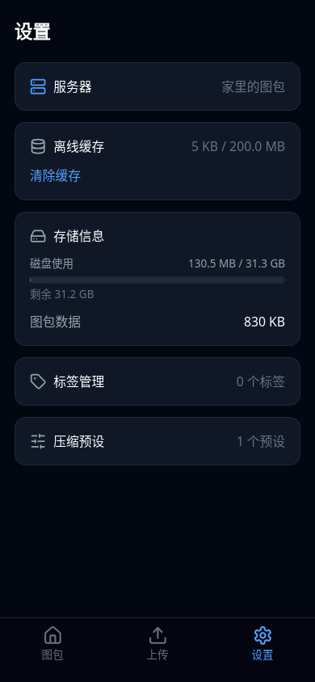
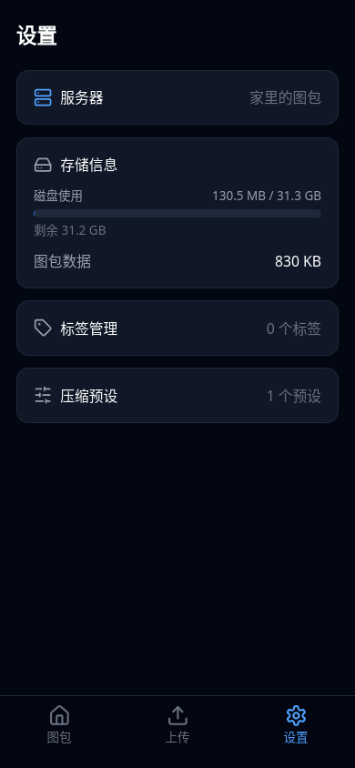
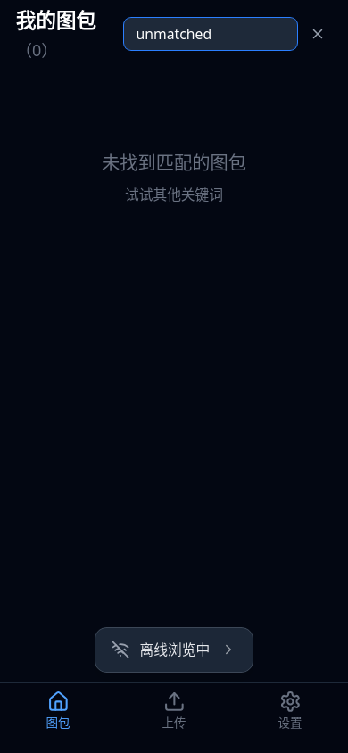
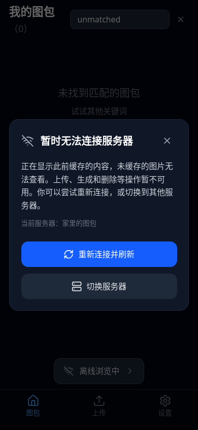
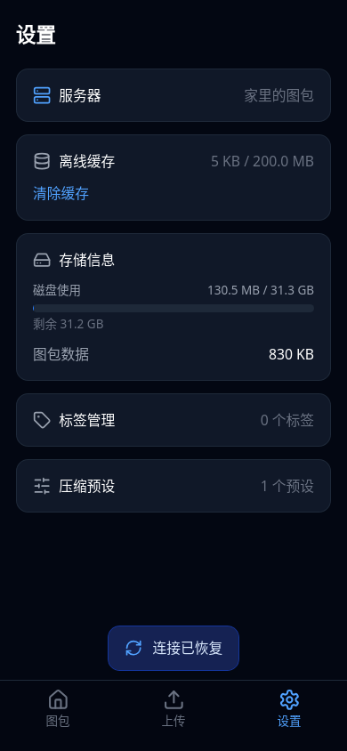

# PWA 与离线浏览

WebKit、390 × 844 手机视口，模拟 iOS `navigator.standalone` 安装模式；尚未验证 iOS 真机。

| 已安装 PWA | 普通浏览器 |
| --- | --- |
|  |  |

只有 PWA 显示离线缓存，标题右侧显示合计用量 / 上限。「清除缓存」清空所有服务器的业务缓存。

| 离线提示 | 离线说明 |
| --- | --- |
|  |  |

恢复后点击提示或第一个 tab 会刷新到图包页，保留分页、筛选等查询条件。不会静默更新当前内容。

验证覆盖：PWA 与普通浏览器共用 Worker 时的业务缓存隔离、清除缓存、离线重开、恢复后点击提示/首页、分页及筛选保留。
